Smart contracts on Ethereum aren't just code—they're immutable programs that manage real value. This introduces constraints that don't exist in traditional software engineering. Let's explore how these constraints shape contract architecture.

## The Execution Environment

Every smart contract executes in the Ethereum Virtual Machine (EVM). Understanding this environment is crucial for writing efficient, secure contracts.

### Storage Layout

Contract state is stored in a key-value store where both keys and values are 256-bit words. This has important implications:

```solidity
contract StorageExample {
    // Slot 0: Single value
    uint256 public value;
    
    // Slot 1: Packed variables (32 bytes total)
    uint128 public a;  // Lower 16 bytes
    uint128 public b;  // Upper 16 bytes
    
    // Slot 2: Start of dynamic array
    uint256[] public dynamicArray;
    // Actual elements stored at keccak256(2) + index
    
    // Slot 3: Mapping (slot stores nothing)
    mapping(address => uint256) public balances;
    // Values stored at keccak256(key . 3)
}
```

<Callout type="info" title="Storage Costs">
Writing to storage costs 20,000 gas for new values and 5,000 gas for updates. This makes storage layout optimization critical for gas efficiency.
</Callout>

### Variable Packing

The compiler packs smaller types into single storage slots when possible. This optimization can significantly reduce gas costs:

```solidity
// Inefficient: 3 storage slots
contract Inefficient {
    uint128 a;  // Slot 0 (wastes 16 bytes)
    uint256 b;  // Slot 1
    uint128 c;  // Slot 2 (wastes 16 bytes)
}

// Efficient: 2 storage slots
contract Efficient {
    uint128 a;  // Slot 0, lower 16 bytes
    uint128 c;  // Slot 0, upper 16 bytes
    uint256 b;  // Slot 1
}
```

## Common Design Patterns

### The Checks-Effects-Interactions Pattern

This pattern prevents reentrancy attacks by ordering operations correctly:

```solidity
function withdraw(uint256 amount) external {
    // 1. Checks: Validate conditions
    require(balances[msg.sender] >= amount, "Insufficient balance");
    
    // 2. Effects: Update state BEFORE external calls
    balances[msg.sender] -= amount;
    
    // 3. Interactions: External calls last
    (bool success, ) = msg.sender.call{value: amount}("");
    require(success, "Transfer failed");
}
```

<Callout type="warning" title="Reentrancy Risk">
Never update state after external calls. The external contract can call back into your contract before state updates complete.
</Callout>

### The Access Control Pattern

Modern contracts use role-based access control for flexibility:

```solidity
import "@openzeppelin/contracts/access/AccessControl.sol";

contract Marketplace is AccessControl {
    bytes32 public constant MODERATOR_ROLE = keccak256("MODERATOR_ROLE");
    bytes32 public constant PAUSER_ROLE = keccak256("PAUSER_ROLE");
    
    constructor() {
        _grantRole(DEFAULT_ADMIN_ROLE, msg.sender);
    }
    
    function moderateContent(uint256 contentId) 
        external 
        onlyRole(MODERATOR_ROLE) 
    {
        // Moderation logic
    }
}
```

## Upgradability Considerations

Smart contracts are immutable by default. There are patterns to work around this, each with trade-offs:

### Proxy Patterns

The Transparent Proxy pattern separates storage from logic:

```mermaid
graph LR
    Proxy["Proxy<br/>(Storage)<br/>delegatecall"] -.->|delegatecall| Implementation["Implementation<br/>(Logic)"]
    classDef box fill:#1a1b26,stroke:#a9b1d6,stroke-width:2px;
    class Proxy,Implementation box;
```



Key considerations:
- **Storage collisions**: Implementation must match proxy storage layout
- **Function selector clashes**: Admin functions can conflict with implementation
- **Centralization risk**: Upgrade authority is a single point of failure

<Callout type="error" title="Security Consideration">
Upgradeable contracts introduce centralization. The upgrade admin effectively controls the contract. Consider timelocks, multisigs, or governance for critical contracts.
</Callout>

### Diamond Pattern (EIP-2535)

For complex systems, the Diamond pattern allows multiple implementation contracts:

```solidity
// Simplified Diamond structure
contract Diamond {
    mapping(bytes4 => address) public selectorToFacet;
    
    fallback() external payable {
        address facet = selectorToFacet[msg.sig];
        require(facet != address(0), "Function not found");
        
        assembly {
            calldatacopy(0, 0, calldatasize())
            let result := delegatecall(gas(), facet, 0, calldatasize(), 0, 0)
            returndatacopy(0, 0, returndatasize())
            switch result
            case 0 { revert(0, returndatasize()) }
            default { return(0, returndatasize()) }
        }
    }
}
```

## Gas Optimization Strategies

### Memory vs Calldata

Use `calldata` for read-only function parameters to save gas:

```solidity
// More expensive: copies to memory
function processData(bytes memory data) external { }

// Cheaper: reads directly from calldata
function processData(bytes calldata data) external { }
```

### Unchecked Arithmetic

When overflow/underflow is impossible, skip checks:

```solidity
function increment(uint256 i) external pure returns (uint256) {
    // Safe when i < type(uint256).max
    unchecked {
        return i + 1;  // Saves ~100 gas
    }
}
```

### Custom Errors

Custom errors are more gas-efficient than require strings:

```solidity
// Expensive
require(balance >= amount, "Insufficient balance");

// Cheaper
error InsufficientBalance(uint256 available, uint256 required);
if (balance < amount) revert InsufficientBalance(balance, amount);
```

## Testing Architecture

A robust testing pyramid for smart contracts:

```mermaid
graph TD
    Invariant["Invariant Tests<br/><span style='font-size:0.8em'>Properties that must always hold</span>"]
    Fuzz["Fuzz Tests<br/><span style='font-size:0.8em'>Random inputs, edge cases</span>"]
    Integration["Integration Tests<br/><span style='font-size:0.8em'>Multi-contract interactions</span>"]
    Unit["Unit Tests<br/><span style='font-size:0.8em'>Individual function behavior</span>"]
    
    Invariant --- Fuzz
    Fuzz --- Integration
    Integration --- Unit
    
    classDef layer fill:#1a1b26,stroke:#a9b1d6,stroke-width:2px;
    class Invariant,Fuzz,Integration,Unit layer;
```



Example invariant test with Foundry:

```solidity
function invariant_totalSupply() public {
    uint256 sum = 0;
    for (uint i = 0; i < actors.length; i++) {
        sum += token.balanceOf(actors[i]);
    }
    assertEq(sum, token.totalSupply());
}
```

## Conclusion

Smart contract architecture requires thinking differently than traditional software. The constraints of immutability, gas costs, and adversarial environments shape every design decision. By understanding storage layout, applying security patterns, and building comprehensive test suites, we can build contracts that are both efficient and secure.

The key takeaways:
1. **Storage is expensive**—optimize layout and minimize writes
2. **Order matters**—always check-effects-interactions
3. **Test extensively**—invariants and fuzzing catch edge cases
4. **Upgradability is a trade-off**—centralization for flexibility

Next, we'll explore how Ethereum's execution model compares to Bitcoin's UTXO model.
