When most developers first encounter blockchain, they think of accounts with balances—like a bank. Ethereum works this way. But Bitcoin uses a fundamentally different model: Unspent Transaction Outputs (UTXOs). Understanding this difference is crucial for anyone working on blockchain systems.

## The Account Model (Ethereum)

Ethereum's model is intuitive. Each address has a balance, and transactions modify that balance:

```
Before:  Alice: 10 ETH, Bob: 5 ETH
Transaction: Alice sends 3 ETH to Bob
After:   Alice: 7 ETH, Bob: 8 ETH
```

The state tracks account balances directly:

```solidity
// Conceptually, Ethereum state includes:
mapping(address => uint256) balances;
mapping(address => uint256) nonces;  // Replay protection
```

### Advantages of Account Model

1. **Simplicity**: Easy to understand and query balances
2. **Space efficiency**: Only stores current balance, not history
3. **Smart contracts**: Natural fit for complex contract state

### Transaction Format

```json
{
  "from": "0xAlice...",
  "to": "0xBob...",
  "value": "3000000000000000000",
  "nonce": 42,
  "gasLimit": 21000,
  "signature": "..."
}
```

## The UTXO Model (Bitcoin)

Bitcoin doesn't track balances—it tracks *unspent outputs*. Think of it like physical cash: you don't modify bills, you spend them and receive change.

```mermaid
graph TD
    subgraph Tx1["Transaction 1"]
        Out0_Tx1["Output 0: 10 BTC<br/>(Spendable by Alice)"]
    end
    
    subgraph Tx2["Transaction 2"]
        Input_Tx2["Input<br/>Ref: Tx1, Output 0"]
        Out0_Tx2["Output 0: 3 BTC<br/>(Spendable by Bob)"]
        Out1_Tx2["Output 1: 7 BTC<br/>(Change for Alice)"]
    end
    
    Out0_Tx1 --> Input_Tx2
    Input_Tx2 -.-> Out0_Tx2
    Input_Tx2 -.-> Out1_Tx2
    
    classDef tx fill:#1a1b26,stroke:#a9b1d6,stroke-width:2px;
    class Tx1,Tx2 tx;
```



<Callout type="info" title="Key Insight">
In Bitcoin, you don't "have" 10 BTC. You control a set of unspent outputs that together sum to 10 BTC. A "balance" is calculated by summing all UTXOs you can spend.
</Callout>

### Transaction Structure

```json
{
  "inputs": [
    {
      "txid": "abc123...",
      "vout": 0,
      "scriptSig": "signature + pubkey"
    }
  ],
  "outputs": [
    {
      "value": 300000000,
      "scriptPubKey": "OP_DUP OP_HASH160 <bobPubKeyHash> OP_EQUALVERIFY OP_CHECKSIG"
    },
    {
      "value": 699990000,
      "scriptPubKey": "OP_DUP OP_HASH160 <alicePubKeyHash> OP_EQUALVERIFY OP_CHECKSIG"
    }
  ]
}
```

## Key Differences

### State Representation

| Aspect | Account Model | UTXO Model |
|--------|--------------|------------|
| State | Account → Balance | Set of unspent outputs |
| Updates | Modify balance | Create/consume UTXOs |
| History | Not inherent | Built into transaction chain |

### Privacy Implications

**Account Model**: Every transaction is clearly linked to an address. Spending patterns are visible:

```
0xAlice → 3 ETH → 0xBob
0xAlice → 2 ETH → 0xCharlie
0xAlice → 1 ETH → 0xDave
```

An observer knows Alice made all these payments.

**UTXO Model**: Each transaction can use different outputs and create new ones:

```mermaid
graph LR
    Output_A["Output_A<br/>(10 BTC)"] --> Tx1
    Tx1 --> Output_B["Output_B<br/>(3 BTC)"]
    Tx1 --> Output_C["Output_C<br/>(7 BTC)"]
    
    Output_B -.-> Bob
    Output_C -.-> Alice["Alice<br/>(change)"]
    
    Output_C --> Tx2
    Tx2 --> Output_D["Output_D<br/>(2 BTC)"]
    Tx2 --> Output_E["Output_E<br/>(5 BTC)"]
    
    Output_D -.-> Charlie
    Output_E -.-> Alice2["Alice<br/>(change)"]
    
    classDef box fill:#1a1b26,stroke:#a9b1d6,stroke-width:2px;
    class Tx1,Tx2 box;
```



<Callout type="success" title="Privacy Advantage">
With UTXO, each transaction can use a fresh change address. This makes transaction graph analysis harder (though not impossible).
</Callout>

### Parallelization

**Account Model Challenge**: Transactions from the same account must be ordered (nonces):

```
Nonce 1: Alice → Bob
Nonce 2: Alice → Charlie
Nonce 3: Alice → Dave
```

These must execute sequentially.

**UTXO Advantage**: Independent UTXOs can be spent in parallel:

```
UTXO_1 (5 BTC) → Bob     ]
UTXO_2 (3 BTC) → Charlie ] Can validate simultaneously
UTXO_3 (2 BTC) → Dave    ]
```

This is why Bitcoin nodes can validate transactions in parallel more easily.

### Smart Contract Complexity

**Account Model**: Natural fit for stateful contracts:

```solidity
contract Token {
    mapping(address => uint256) balances;
    
    function transfer(address to, uint256 amount) external {
        balances[msg.sender] -= amount;
        balances[to] += amount;
    }
}
```

**UTXO Model**: Contracts are harder. Bitcoin Script is intentionally limited:

```
// Bitcoin Script (stack-based)
OP_DUP
OP_HASH160
<pubKeyHash>
OP_EQUALVERIFY
OP_CHECKSIG
```

Extended UTXO models (like Cardano's) add capabilities:

```
UTXO = {
  value: 100 ADA,
  datum: { state: "locked", owner: "alice" },
  validator: scriptHash
}
```

## Trade-off Summary

| Consideration | Account Wins | UTXO Wins |
|--------------|--------------|-----------|
| Developer simplicity | ✓ | |
| State querying | ✓ | |
| Smart contracts | ✓ | |
| Privacy potential | | ✓ |
| Parallel validation | | ✓ |
| Double-spend prevention | | ✓ (simpler) |
| Transaction size | ✓ | |

## Hybrid Approaches

Some systems combine ideas:

### Extended UTXO (Cardano)

Adds data and validation scripts to UTXOs:

```haskell
data TxOut = TxOut
  { txOutAddress :: Address
  , txOutValue   :: Value
  , txOutDatum   :: Maybe Datum  -- Added!
  }
```

### Account Abstraction (Ethereum)

Makes accounts programmable, blurring the line:

```solidity
// ERC-4337 Account
contract SmartAccount {
    function validateUserOp(UserOperation calldata userOp)
        external returns (uint256 validationData);
}
```

## Implementation Considerations

### Building on UTXO

When implementing UTXO-based systems:

1. **UTXO Set Management**: Maintain an efficient index of spendable outputs
2. **Transaction Building**: Select UTXOs to cover payment + fees
3. **Change Handling**: Always send change to a controlled address
4. **Pruning**: Old spent transactions can be discarded

```python
def select_utxos(amount, available_utxos):
    """Simple coin selection algorithm"""
    selected = []
    total = 0
    
    # Sort by value (largest first for fewer inputs)
    for utxo in sorted(available_utxos, key=lambda u: -u.value):
        selected.append(utxo)
        total += utxo.value
        if total >= amount:
            return selected, total - amount  # UTXOs and change
    
    raise InsufficientFunds()
```

### Building on Accounts

For account-based systems:

1. **Nonce Management**: Track and increment correctly
2. **Gas Estimation**: Account for state changes
3. **Concurrent Transactions**: Queue or batch from same account
4. **State Caching**: Balance queries are cheap

## Conclusion

Neither model is objectively "better"—they optimize for different properties:

- **UTXO** prioritizes privacy, parallelism, and simple double-spend prevention
- **Accounts** prioritize developer experience and complex state management

Understanding both helps you:
- Choose the right platform for your use case
- Design better systems on either model
- Appreciate the trade-offs inherent in blockchain design

The next post will explore how these models affect MEV (Miner Extractable Value) and transaction ordering.
